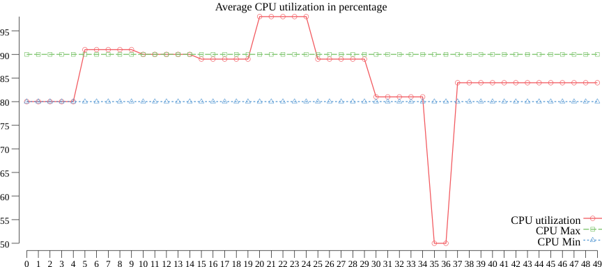
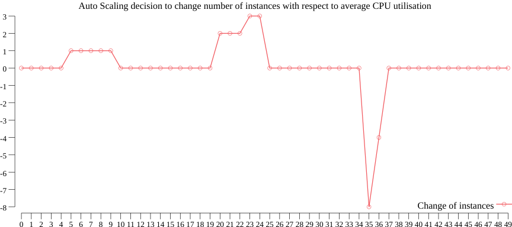

# goautoscale
Scale number of instances in respect to CPU utilization.

## CPUScale
CPUScale calculates how many instances should be added or removed to maintain given CPU utilization
A positive number means to scale up, negative scale down, and zero doesn't do anything.
```go
ctx := Context{
    CPUNoopRange: Range{
        Min: 80,
        Max: 90,
    },
    MaintainsCPUAvg: 85,
    CPUUtilisation:  99,
    Instances:       3,
}

fmt.Println(CPUScale(ctx))
// Positive number means to scale up, negative scale down, and zero don't do anything
// Output: 1
```

Example demonstrate how number of instances changes in regard to average CPU utilisation.

